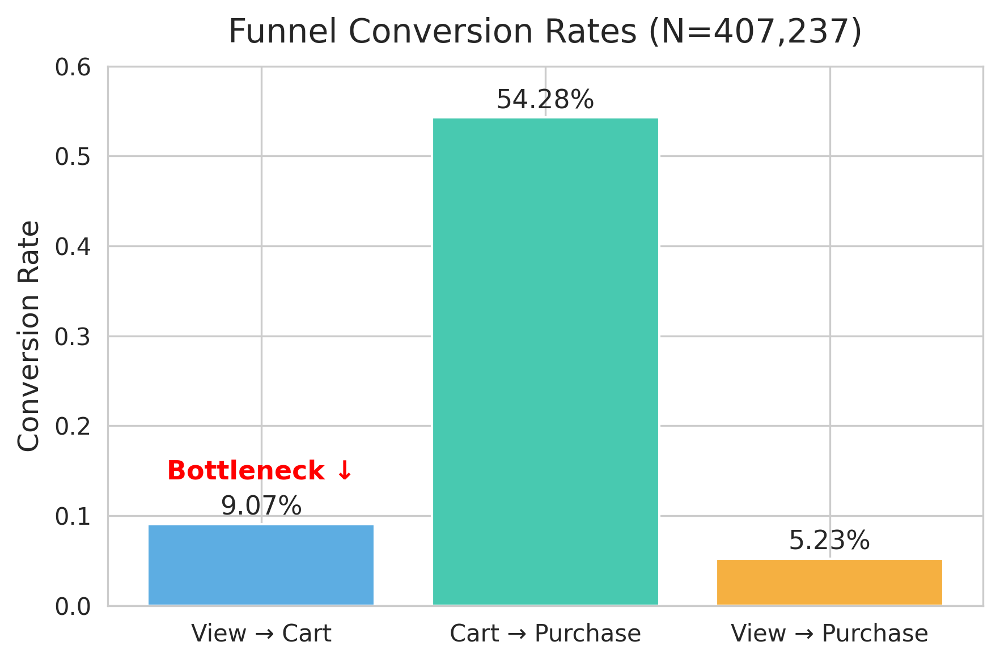
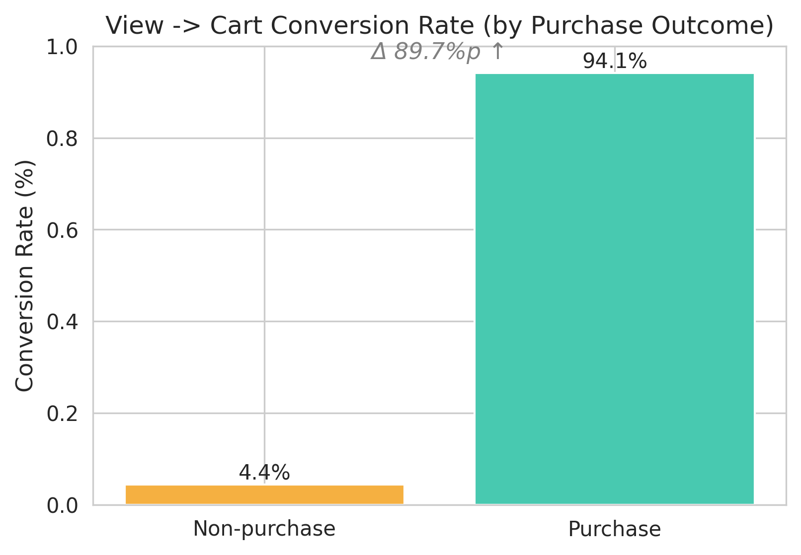
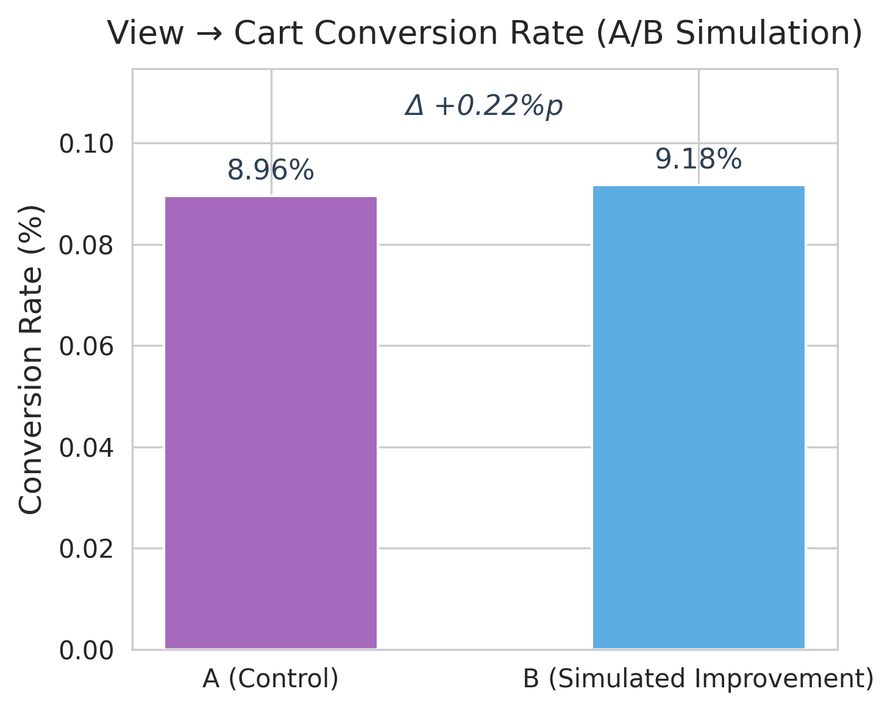

# 📌 E-commerce Funnel & A/B Test Analysis  
개인 프로젝트 (2025)  
전환율 기반 퍼널 분석 · 행동 비교 분석 · A/B 테스트 시뮬레이션 · ROI 추정

---

## 📄 프로젝트 개요  
- **목표**: 이커머스 퍼널(View → Cart → Purchase) 데이터를 분석하여  
  병목 구간을 규명하고, A/B 테스트 시뮬레이션 및 ROI 추정을 통해 개선 효과를 정량적으로 평가  
- **데이터**: Kaggle - *E-commerce Events History in Electronics Store*  
  (약 900,000건의 사용자 행동 로그)  
- **기간**: 2025.10 (2주)  
- **형태**: 개인 프로젝트  

---

## 📂 파일 구성  
```
ecommerce-funnel-abtest/
├─ sql/                     # ① 원시 데이터 전처리 (DuckDB)
│   └─ preprocessing.sql
├─ data/                    # ② SQL 결과 (세션 단위 전환율)
│   └─ session_funnel.csv
├─ notebooks/               # ③ Python 분석 (EDA → Funnel → A/B → ROI)
│   └─ ecommerce_funnel_abtest.ipynb
├─ img/                     # ④ 결과 시각화 이미지
│   ├─ 1.funnel_chart.png
│   ├─ 2.behavior_comparison.png
│   ├─ 3.abtest_result.png
│   └─ 4.roi_estimation.png
├─ README.md                # ⑤ 전체 프로젝트 개요
```
---

## 📄 분석 단계  

### **Process 01 - 데이터 구축 및 전처리 (SQL)**  
- DuckDB로 원본 로그(`events.csv`)를 세션 단위로 가공  
- 결측치 및 중복 제거 후, 세션 단위 행동(event_type)별 집계  
- `View → Cart → Purchase` 단계별 전환율 계산  

---

### **Process 02 - 퍼널 분석 (Funnel Analysis)**  
- SQL 기반으로 전환율 산출  
- View→Cart 구간 전환율이 **9%로 가장 낮은 병목 구간** 확인  
- 전체 세션 중 Cart 진입이 없는 경우가 약 91% 차지  

 *시각화:  *

---

### **Process 03 - 행동 기반 전환 비교 (Behavioral Comparison)**  
> 구매 세션과 미구매 세션의 행동 패턴을 비교하여  
> ‘Cart 진입 행동’이 실제 구매 전환을 예측하는 핵심 요인임을 검증  

| 비교 항목 | 결과 |
|:--|:--|
| View→Cart 전환율 (미구매 vs 구매) | 4.4% vs 94.1% → 구매 세션이 약 21배 높음 |
| 통계 검정 | Z = 185.17, p < 0.001, Cohen’s h = 2.23 (매우 큰 효과) |
| 해석 | 장바구니 진입은 구매 확률을 결정짓는 핵심 행동 변수로 확인됨 |

> **시사점:**  
> View→Cart 단계는 퍼널 전체 효율을 좌우하는 결정적 병목 구간으로,  
> 이후 A/B Test(Process 04)에서 이 구간을 주요 개선 타깃으로 설정함.  

 *시각화: *
 

---

### **Process 04 - A/B 테스트 시뮬레이션 (A/B Test Simulation)**  
- 세션을 A/B 그룹으로 랜덤 분할  
- View→Purchase 전환율 비교 (단측 Z-test)  
- B그룹 전환율 **+0.22%p 상승 (Z=2.48, p=0.0065)**  

 *시각화: *

---

### **Process 05 - ROI 추정 (Return on Investment)**  
- 전환율 +0.5%p 개선 시 매출 상승 효과 추정  

| 지표 | 값 |
|:--|:--|
| 현재 전환율 | 4.9% |
| 개선 후 전환율 | 5.4% |
| 평균 구매금액 | ₩120,000 |
| 전체 세션 수 | 900,000 |
| **예상 매출 증가액** | **₩540,000,000** |

 *시각화: *

---

## 주요 결과 요약  
| 구분 | 결과 요약 |
|------|------------|
| **핵심 병목** | View→Cart 단계 (전환율 9%) |
| **행동 비교 결과** | 구매 세션의 Cart 진입률이 21배 높음 |
| **A/B Test 효과** | B그룹 +0.22%p 전환율 상승 |
| **ROI 추정 결과** | 약 ₩5.4억 매출 상승 효과 |
| **전략 제안** | UI 개선 및 프로모션 노출 최적화 중심 단계별 실험 로드맵 제안 |

---

## 인사이트 및 시사점  
- 단순 전환율 분석을 넘어, **행동 비교 → 실험 설계 → ROI 추정**으로  
  **데이터 기반 마케팅 실험 구조**를 완성  
- View→Cart 구간 개선만으로도 구매 전환 및 매출에 직접적 영향 확인  
- 향후 실제 환경(GA4·Google Optimize)에서 재현 가능성 높음  

---

## 기술 스택  
- **SQL (DuckDB)**: 퍼널 데이터 구축  
- **Python (Colab)**: EDA, 통계 검정, 시각화  
- **Visualization**: Matplotlib  
- **협업/관리**: Git, GitHub  

---

## 📄 참고  
본 프로젝트는 Kaggle 공개 데이터셋을 기반으로 진행된 **개인 학습용 프로젝트**이며,  
실제 기업 데이터가 아님을 명시합니다.


